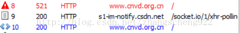

# 521反爬虫解决方法之java篇

> 原文：https://blog.csdn.net/zhangscheng922/article/details/73522321

项目需要爬 http://www.cnvd.org.cn/ ，发现每次都是521失败，返回的结果是一段JS代码。于是开始各种度娘。原来这段JS代码是生成一个参数并放到cookie中，然后重新发送一次请求，这样第二次请求就能带上这个参数以及上次请求返回的cookie信息，到后台进行验证。原因知道了，但是问题并没有解决。返回的JS代码用了很多乱七八糟的符号替换来替换去，有人说是在加密，反正我没看懂.....但是大致的东西看懂了一些。通过fidder可以观察到使用浏览器访问时其实是发送了两次请求，


第一次请求拿到的结果如下：


第二次请求：


前这样就发现第二次请求在cookie中多了一个__jsl_clearance参数。这个参数哪来的呢，看第一几次请求返回的JS代码。面声明了一大堆变量，只关注最后最后一句即可，将字符串转为可执行的JS代码，那这个字符串是什么，只需将这段代码拿到html文件中用浏览器执行下就知道了。
这就清晰了许多，if语句是执行方法1的。方法里 setTimeout 是刷新页面重新发送一次请求，document.cookie 是向cookie中添加 dc这个参数。如果能拿到dc的值，添加到我们自己的java代码里岂不是可以再请求一次就能拿到页面的html代码了。思路已然很清晰。
……
总结：1、对于爬虫返回521，每个网站原因是不一样的，有的可能只是对请求头信息验证不通过，有的是对cookie验证等等，具体得通过工具查看浏览器是如何访问的，模仿浏览器访问。
   2、对于返回JS代码的，每个网站的代码逻辑也不同，需要具体对待，但最终都是生成参数用于第二次请求，也有的会在第一次响应头加入一些参数需要再第二次请求也带上的，都需要注意。
> ### selenium HtmlUnitDriver实现方法

pom.xml
```xml
<dependency>
  <groupId>org.seleniumhq.selenium</groupId>
  <artifactId>selenium-java</artifactId>
  <version>3.5.3</version>
</dependency>
<dependency>
  <groupId>org.seleniumhq.selenium</groupId>
  <artifactId>selenium-htmlunit-driver</artifactId>
  <version>2.52.0</version>
</dependency>
<dependency>
  <groupId>org.apache.httpcomponents</groupId>
  <artifactId>httpclient</artifactId>
  <version>4.5.2</version>
</dependency>
<dependency>
  <groupId>commons-io</groupId>
  <artifactId>commons-io</artifactId>
  <version>2.4</version>
</dependency>
```

java
```java
public class TestSelenium {  
    public static void main(String[] args) {  
        HtmlUnitDriver driver = new HtmlUnitDriver();  
        //必须设置为true,才能执行js代码  
        driver.setJavascriptEnabled(true);  
        driver.get("http://www.cnvd.org.cn/");  
        /*Set<Cookie> cookies = driver.manage().getCookies(); 
        for (Cookie cookie:cookies){ 
            System.out.println(cookie); 
        }*/  
        driver.setJavascriptEnabled(false);  
        driver.get("http://www.cnvd.org.cn/flaw/show/CNVD-2017-30496");  
        String pageSource = driver.getPageSource();  
        System.out.println(pageSource);  
    }  
}
```
> ##个人注：
本人爬取的是千里马招标网[http://search.qianlima.com/search.jsp?p_xs=1&p_tflt=31&p_area=-1&p_state=0&p_type=0&q_kat=0&q_mod=2&q=%BA%C4%B2%C4+%D2%A9%C6%B7+%CA%D4%BC%C1+%C9%E8%B1%B8&p=1](http://search.qianlima.com/search.jsp?p_xs=1&p_tflt=31&p_area=-1&p_state=0&p_type=0&q_kat=0&q_mod=2&q=%BA%C4%B2%C4+%D2%A9%C6%B7+%CA%D4%BC%C1+%C9%E8%B1%B8&p=1)，需要请求3次，在```driver.setJavascriptEnabled(false);```，再请求一次即可。<font color="red">**一定要加在```driver.setJavascriptEnabled(false);```前面！**</font>