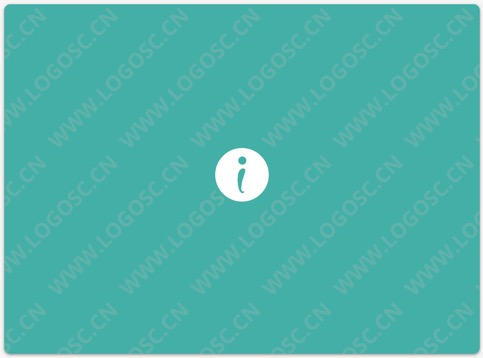
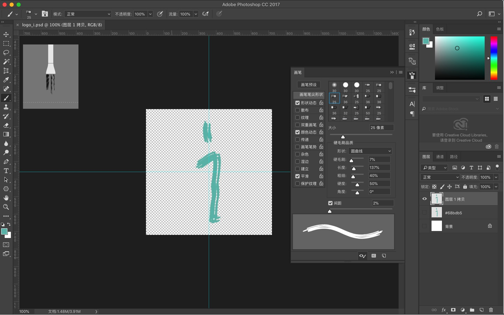

<h3 style='text-align:center'>00</h3>

之前转载了一篇关于破解jetbrains软件的文章放在了github的博客里，然后前几天收到了一封github的邮件：说是被jetbrains举报了，要求24小时之内删除侵权的内容。结果自己收到邮件的时候没留意，等超过了24小时的期限才发现仓库被禁了，然后就懵逼了。

后来按照一篇帖子[GitHub 仓库出现 Repository unavailable due to DMCA takedown. 的解决方法](https://www.jianshu.com/p/26584f84229c)的指示，给github客服发了邮件，让帮忙把禁用的仓库直接删掉了，然后用旧的名称新建了仓库。

其实我一直觉得自己还是有一定的版权意识的，转载东西之类的都会注明来源。但是这次这个事真是让自己长了教训。只能说，感谢自己能这么早意识到这个问题——这次的事件也没造成什么麻烦，算是万幸吧。

然后……这一周里，我“设计”（可能要侮辱一次这2个字了）了2个头像：自己用的头像和微信公众号的头像。

<h3 style='text-align:center'>01</h3>

先说自己用的头像。自己设计之初的想法是**简单**、**积极**。然后看了几个设计logo的网站，找了找灵感。这里推荐一个自己觉得还不错的平台：logo生成，网址：https://www.logosc.cn/，微信公众号也叫“logo生成”。我用“RamblerW”作为名称、“RamblingMyWayofLife”作为标语试了下，下面这些是我还蛮有感觉的：

倒数第5个中，左边的那个图标我觉得挺喜欢的，然后联想到了word里的序号图标 ➢ ，然后就决定画一个类似于 ➢ 的纯色图标（自我认为一个向右的箭头有“前进”的含义，所以还是很励志的，哈哈），颜色嘛，就看上了最后这一张的。然后就用自己仅有的Photoshop功底画了一个。喏 ↓↓↓

（换完头像后，我妈说：为啥换头像，我不认识了……）

<h3 style='text-align:center'>02</h3>

说微信公众号的头像之前，先来说说微信公众号的新名字：iRambler。微信公众号的简介就是“做有趣的事，做有趣的人”，double interesting，然后就取了首字母 i。取完名字之后突然觉得，哇，这个“i”不得了啊，iphone、iwatch、ipad、imac、ireader……总之感觉，单单一个“i”，想象的空间特别大。

<h3 style='text-align:center'>03</h3>

名字取完了，logo的创意也就有了，就是一个“i”。logo的含义方面，这次在**简单**、**积极**的基础上再增加一个**活泼**。然后在[logo生成](https://www.logosc.cn/)平台搜了搜，看到了一个比较喜欢的：

有几次都差点下决心买了，结果看了一下网站的说明，好像是有些logo是搜集来的，不保证其他人不会使用，版权纠纷什么的网站也概不负责，只有网站设计师专门设计的才保证版权问题，然后询问客服也一直没有等到回复。最后，脑大洞开，自己用Photoshop的画笔随便画了一笔，logo就成了😂。

后来想了想，这个logo好处贼多啊。首先，肯定不会重复，连我自己都画不出来一个一样的；其次，想换就换，哪天再随便画一笔，哎，又是一个logo。哈哈！

<h3 style='text-align:center'>写在最后</h3>

- 其实自己用的头像什么的，应该很随意的，没什么版权问题。主要自己之前的头像发生过“撞衫”的尴尬，然后自己一下子又没什么中意的头像，所以这次也就一并换了。
- 公众号的头像，画完后发现，**积极**和**活泼**没了（本来准备画一个人向前奔跑的样子，奈何水平有限），算了，不要了！